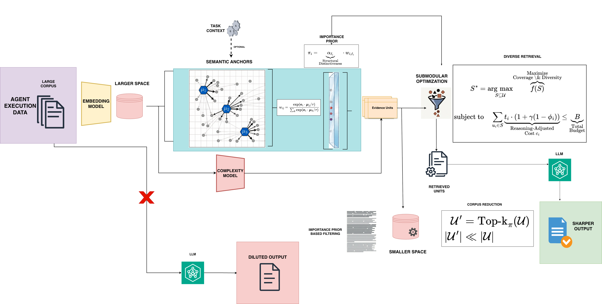

# Query-Independent Budgeted Evidence Retrieval

A research framework for selecting representative evidence chunks from a corpus under strict budget constraints **without requiring any query or decision input**. This system combines **semantic anchor-based importance scoring** (via centroids or coresets), **reasoning complexity estimation**, **submodular optimization objectives**, and **diversity-aware selection algorithms** to retrieve high-value evidence while minimizing redundancy.


---

## Key Features

- **Query-Free Retrieval**: Retrieves important evidence based purely on semantic structure and information density—no query or user intent required at retrieval time
- **Reasoning-Adjusted Cost Model**: Penalizes low-information "fluff" content, prioritizing dense, reasoning-heavy chunks
- **Submodular Optimization**: Guarantees near-optimal coverage with diversity through proven optimization techniques
- **Multimodal Ready**: Architecture supports any embedding model, including multimodal embeddings (text, images, figures, tables)—currently evaluated with text embeddings due to lack of labeled multimodal benchmarks
- **Hierarchical Evaluation**: Measures coverage against held-out requirements without using them during retrieval

---

## Multimodal Extensibility

While current evaluation uses text-only embedding models, the framework is **designed to work with any multimodal embedding system**:

- **Evidence units** can represent any modality: text chunks, images, figures, tables, or mixed content
- **Embeddings** can come from any encoder: text-only (BERT, BGE), vision (CLIP, SigLIP), or unified multimodal models (ImageBind, ONE-PEACE)
- **Importance scoring** operates on embedding geometry, agnostic to the underlying modality
- **Cost model** can incorporate modality-specific penalties (e.g., higher cost for images in token-limited contexts)

To use multimodal embeddings, simply provide embeddings from your multimodal encoder in the expected format—no code changes required.

---

## Workflow Overview

The pipeline operates in the following stages:

1. **Input**: Large corpus of evidence units (text chunks, images, figures, etc.) with pre-computed embeddings
   - Optionally, a user profile can be incorporated for personalized importance weighting

2. **Semantic Anchors**: Compute centroids or coresets of the embedding space
   - These anchors guide the importance scoring by identifying semantically distinct regions

3. **Per-Unit Scoring**: Each evidence unit receives:
   | Attribute | Description |
   |-----------|-------------|
   | **Importance Score** ($\pi$) | Distinctiveness × representativeness via semantic anchors |
   | **Reasoning Complexity** ($\phi$) | 0–1 score from complexity model (proxy for information density) |
   | **Token Count** ($t$) | Number of tokens in the unit |
   | **Modality** | Text, image, figure, table, etc. |

4. **Reasoning-Adjusted Cost**: Compute cost as $c = t \cdot (1 + \gamma(1 - \phi))$
   - Dense content ($\phi \approx 1$) → minimal penalty
   - Fluffy content ($\phi \approx 0$) → maximum penalty

5. **Submodular Optimization**: Select units maximizing coverage subject to budget constraint
   - Balances importance, diversity, and cost-efficiency

6. **Output**: Retrieved evidence units optimized for coverage within budget

---

## Table of Contents

- [Key Features](#key-features)
- [Multimodal Extensibility](#multimodal-extensibility)
- [Workflow Overview](#workflow-overview)
- [Problem Formulation](#problem-formulation)
- [Mathematical Framework](#mathematical-framework)
  - [Importance Scoring](#1-importance-scoring)
    - [Centroid Prior Scoring](#11-k-means-prior-scoring-prior_method-centroid)
    - [Coreset Prior Scoring](#12-coreset-prior-scoring-prior_method-coreset)
  - [Cost Model](#2-cost-model)
  - [Selection Objectives](#3-selection-objectives)
  - [Solvers](#4-solvers)
  - [Evaluation Metrics](#5-evaluation-metrics)
- [Architecture](#architecture)
- [Installation](#installation)
- [Usage](#usage)
- [Configuration](#configuration)
- [Output Format](#output-format)

---

## Problem Formulation

Given a set of evidence units $\mathcal{U} = \{u_1, u_2, \ldots, u_n\}$ from academic papers, each with:
- An embedding vector $\mathbf{e}_i \in \mathbb{R}^d$
- A token count $t_i \in \mathbb{Z}^+$
- A computed cost $c_i \in \mathbb{Z}^+$
- An importance score $\pi_i \in [0, 1]$

**Objective:** Select a subset $S \subseteq \mathcal{U}$ that maximizes a utility function $f(S)$ subject to a budget constraint:

$$\max_{S \subseteq \mathcal{U}} f(S) \quad \text{s.t.} \quad \sum_{u_i \in S} c_i \leq B$$

where $B$ is the total budget.

---

## Mathematical Framework

### 1. Importance Scoring

The framework supports two query-independent importance scoring methods, controlled by the `prior_method` configuration parameter.

#### 1.1 Centroid Prior Scoring (`prior_method: centroid`)

The `ImportancePriorScorer` computes importance without any query, using Centroid clustering-based distinctiveness.

**Step 1: Centroid Clustering**

Cluster embeddings into $k$ clusters where $k = \lfloor\sqrt{n}\rfloor$ by default:

$$\{\mathcal{C}_1, \mathcal{C}_2, \ldots, \mathcal{C}_k\} = \text{KMeans}(\{\mathbf{e}_1, \ldots, \mathbf{e}_n\}, k)$$

Let $\boldsymbol{\mu}_j$ denote the centroid of cluster $\mathcal{C}_j$.

**Step 2: Centroid Similarity Matrix**

Compute cosine similarity between all pairs of centroids:

$$S_{ij} = \frac{\boldsymbol{\mu}_i \cdot \boldsymbol{\mu}_j}{\|\boldsymbol{\mu}_i\| \|\boldsymbol{\mu}_j\|}$$

**Step 3: Cluster Distinctiveness**

For each cluster $j$, compute distinctiveness $\alpha_j$ using the top-$m$ most similar clusters:

$$\alpha_j = 1 - \frac{1}{m} \sum_{i \in \text{TopM}_j} S_{ji}$$

where $\text{TopM}_j = \arg\text{top}_m\{S_{ji} : i \neq j\}$

High $\alpha_j$ indicates cluster $j$ is semantically distinct from other clusters.

**Step 4: Unit Importance Score**

For unit $u_i$ assigned to cluster $\ell_i$:

1. Compute similarity to all centroids:
   $$s_{ij} = \frac{\mathbf{e}_i \cdot \boldsymbol{\mu}_j}{\|\mathbf{e}_i\| \|\boldsymbol{\mu}_j\|}$$

2. Apply softmax with temperature $\tau$:
   $$w_{ij} = \frac{\exp(s_{ij} / \tau)}{\sum_{j'} \exp(s_{ij'} / \tau)}$$

3. Final importance score:
   $$\pi_i = \alpha_{\ell_i} \cdot w_{i,\ell_i}$$

The score combines cluster distinctiveness with how well the unit represents its assigned cluster.

#### 1.2 Coreset Prior Scoring (`prior_method: coreset`)

The `CoresetImportanceScorer` replaces Centroid clustering with **Greedy Facility Location** for representative selection. Unlike Centroid, representatives are actual data points rather than synthetic centroids, making this approach more robust to outliers and non-spherical cluster shapes.

**Step 1: Greedy Facility Location Selection**

Select $k$ representative points $\mathcal{R} = \{r_1, r_2, \ldots, r_k\}$ that minimize the total distance from all points to their nearest representative:

$$\min_{\mathcal{R} \subseteq \mathcal{U}, |\mathcal{R}| = k} \sum_{i=1}^{n} \min_{r \in \mathcal{R}} d(\mathbf{e}_i, \mathbf{e}_r)$$

where $d(\mathbf{e}_i, \mathbf{e}_r) = \|\hat{\mathbf{e}}_i - \hat{\mathbf{e}}_r\|_2$ is the Euclidean distance on L2-normalized embeddings (equivalent to $\sqrt{2(1 - \cos(\mathbf{e}_i, \mathbf{e}_r))}$).

**Greedy Algorithm:**

1. **Initialize:** Select the most central point:
   $$r_1 = \arg\min_{j \in \mathcal{U}} \sum_{i=1}^{n} d(\mathbf{e}_i, \mathbf{e}_j)$$

2. **Iterate:** For $t = 2, \ldots, k$, select the point with maximum marginal gain:
   $$r_t = \arg\max_{j \in \mathcal{U} \setminus \mathcal{R}} \sum_{i=1}^{n} \max\left(0, d_{\min}(i) - d(\mathbf{e}_i, \mathbf{e}_j)\right)$$

   where $d_{\min}(i) = \min_{r \in \mathcal{R}} d(\mathbf{e}_i, \mathbf{e}_r)$ is the current minimum distance for point $i$.

3. **Assign:** Each unit is assigned to its nearest representative:
   $$\ell_i = \arg\min_{j \in \{1, \ldots, k\}} d(\mathbf{e}_i, \mathbf{e}_{r_j})$$

**Step 2: Representative Similarity Matrix**

Compute cosine similarity between all pairs of representatives:

$$S_{ij} = \frac{\mathbf{e}_{r_i} \cdot \mathbf{e}_{r_j}}{\|\mathbf{e}_{r_i}\| \|\mathbf{e}_{r_j}\|}$$

**Step 3: Representative Distinctiveness**

For each representative $j$, compute distinctiveness $\alpha_j$ using the top-$m$ most similar representatives:

$$\alpha_j = 1 - \frac{1}{m} \sum_{i \in \text{TopM}_j} S_{ji}$$

High $\alpha_j$ indicates representative $j$ covers a semantically distinct region.

**Step 4: Unit Importance Score**

For unit $u_i$ assigned to representative $\ell_i$:

1. Compute similarity to all representatives:
   $$s_{ij} = \frac{\mathbf{e}_i \cdot \mathbf{e}_{r_j}}{\|\mathbf{e}_i\| \|\mathbf{e}_{r_j}\|}$$

2. Apply softmax with temperature $\tau$:
   $$w_{ij} = \frac{\exp(s_{ij} / \tau)}{\sum_{j'} \exp(s_{ij'} / \tau)}$$

3. Final importance score:
   $$\pi_i = \alpha_{\ell_i} \cdot w_{i,\ell_i}$$

**Key Differences from Centroid:**

| Aspect | Centroid | Coreset (Facility Location) |
|--------|---------|----------------------------|
| Representatives | Synthetic centroids (geometric means) | Actual data points |
| Optimization | Minimizes within-cluster variance | Minimizes total distance to nearest representative |
| Robustness | Sensitive to outliers | More robust to outliers |
| Cluster shapes | Assumes spherical clusters | Handles non-spherical distributions |

---

### 2. Cost Model

The `PenaltyCostProfiler` applies a semantic density penalty to token costs.

**Semantic Density ($\phi$)**

Using a ModernBERT-based classifier, compute $\phi \in [0, 1]$ where:
- $\phi \approx 1.0$: Dense, reasoning-heavy content
- $\phi \approx 0.0$: Fluffy, low-information content

**For classification output** (softmax over $C$ classes):
$$\phi = \frac{\sum_{c=0}^{C-1} c \cdot p_c}{C - 1}$$

**For regression output** (single logit):
$$\phi = \sigma(\text{logit}) = \frac{1}{1 + e^{-\text{logit}}}$$

**Cost Formula**

$$c_i = t_i \cdot (1 + \gamma \cdot (1 - \phi_i))$$

where:
- $t_i$ = token count
- $\gamma$ = penalty weight (default: 1.0)
- $\phi_i$ = semantic density

**Interpretation:**
- Dense content ($\phi=1$): $c_i = t_i$ (no penalty)
- Fluffy content ($\phi=0$): $c_i = t_i \cdot (1 + \gamma)$ (maximum penalty)

---

### 3. Selection Objectives

All objectives define a marginal gain function $g(u | S)$ for adding unit $u$ to selected set $S$.

#### 3.1 Maximal Marginal Relevance (MMR)

Balances relevance and diversity:

$$g_{\text{MMR}}(u | S) = \lambda \cdot \pi_u - (1 - \lambda) \cdot \max_{v \in S} \text{sim}(u, v)$$

where:
- $\lambda \in [0, 1]$ controls the relevance-diversity trade-off (default: 0.5)
- $\text{sim}(u, v) = \frac{\mathbf{e}_u \cdot \mathbf{e}_v}{\|\mathbf{e}_u\| \|\mathbf{e}_v\|}$ (cosine similarity)

#### 3.2 GraphCut

Penalizes redundancy with all selected items:

$$g_{\text{GC}}(u | S) = \pi_u - \sum_{v \in S} \text{sim}(u, v)$$

**Interpretation:** The gain decreases linearly with total similarity to already-selected items.

#### 3.3 Facility Location

Measures coverage improvement across all units:

$$g_{\text{FL}}(u | S) = \sum_{i=1}^{n} \max\left(0, \text{sim}(i, u) - \max_{v \in S} \text{sim}(i, v)\right)$$

**Interpretation:** Each unit $i$ contributes gain only if $u$ is more similar to it than any currently selected item.

#### 3.4 DPP Log-Determinant

Determinantal Point Processes balance quality and diversity through a kernel matrix.

**L-Matrix Construction:**

$$\mathbf{L} = \text{diag}(\mathbf{q}) \cdot \mathbf{S} \cdot \text{diag}(\mathbf{q})$$

where:
- $\mathbf{q} = [\pi_1^w, \pi_2^w, \ldots, \pi_n^w]$ (quality vector, $w$ = quality weight)
- $\mathbf{S}_{ij} = \text{sim}(i, j)$ (similarity matrix)

**Marginal Gain via Schur Complement:**

For adding $u$ to set $S$:

$$g_{\text{DPP}}(u | S) = \log\det(\mathbf{L}_{S \cup \{u\}}) - \log\det(\mathbf{L}_S)$$

Using the Schur complement:

$$g_{\text{DPP}}(u | S) = \log\left(L_{uu} - \mathbf{L}_{uS} \mathbf{L}_S^{-1} \mathbf{L}_{Su}\right)$$

where:
- $L_{uu}$ = diagonal entry for unit $u$
- $\mathbf{L}_{uS}$ = row vector of $u$'s entries for indices in $S$
- $\mathbf{L}_{Su}$ = column vector (transpose of above)

---

### 4. Solvers

#### 4.1 Greedy Solver

Standard greedy selection:

$$u^* = \arg\max_{u \in \mathcal{U} \setminus S} g(u | S) \quad \text{s.t.} \quad c_u + \sum_{v \in S} c_v \leq B$$

Repeat until no feasible candidate exists.

#### 4.2 Cost-Normalized Solver

Efficiency-aware greedy using gain-to-cost ratio:

$$u^* = \arg\max_{u \in \mathcal{U} \setminus S} \frac{g(u | S)}{c_u} \quad \text{s.t.} \quad c_u + \sum_{v \in S} c_v \leq B$$

Better handles heterogeneous costs by preferring high-efficiency items.

#### 4.3 Top-K Solver

Simple baseline without diversity consideration:

1. Sort units by importance: $\pi_{\sigma(1)} \geq \pi_{\sigma(2)} \geq \cdots \geq \pi_{\sigma(n)}$
2. Greedily select in order until budget exhausted

#### 4.4 DPP Solver

Uses DPP log-determinant gain (Section 3.4) with greedy selection under budget constraints.

---

### 5. Evaluation Metrics

> **Important:** Our retrieval is **query-free**—the decision nodes and requirements are **not** passed as input to the retrieval system. They are used **only at evaluation time** to measure how well blind, importance-based retrieval covers the information needs. This simulates real-world scenarios where user intent is unknown at indexing/retrieval time.

#### 5.1 Coverage Metrics (Query-Free Evaluation)

**Ideal Mass:** Maximum achievable similarity to all evidence for each requirement $r$:

$$M_{\text{ideal}} = \sum_{r \in \mathcal{R}} \max_{u \in \mathcal{U}} \text{sim}(r, u)$$

**Captured Mass:** Similarity achieved by selected subset:

$$M_{\text{captured}} = \sum_{r \in \mathcal{R}} \max_{u \in S} \text{sim}(r, u)$$

**Coverage Ratio:**

$$\text{Coverage} = \frac{M_{\text{captured}}}{M_{\text{ideal}}}$$

Applied separately to:
- **Global GR Coverage:** General requirements (broad information needs *used only for evaluation, not retrieval*)
- **Decision Node Coverage:** Each specific requirement category (D1, D2, etc.)—*used only for evaluation, not retrieval*
- **Average Decision Coverage:** Mean across all decision nodes

#### 5.2 Redundancy Score

Mean off-diagonal cosine similarity (lower is better):

$$\text{Redundancy} = \frac{2}{|S|(|S|-1)} \sum_{i < j, \, u_i, u_j \in S} \text{sim}(u_i, u_j)$$

Values $> 0.8$ indicate nearly identical chunks selected.

#### 5.3 Information Density

Mean importance of selected items (higher is better):

$$\text{Density} = \frac{1}{|S|} \sum_{u \in S} \pi_u$$

#### 5.4 Semantic Volume

Log-determinant of the similarity kernel (higher is better):

$$\text{Volume} = \log\det(\mathbf{K}_S + \epsilon \mathbf{I})$$

where $\mathbf{K}_S$ is the cosine similarity matrix of selected embeddings and $\epsilon$ provides numerical stability.

**Interpretation:** Measures the "volume" of semantic space covered. Higher values indicate greater diversity.

---

## Architecture

```
budgeted-ret/
├── main.py                 # Entry point and pipeline orchestration
├── config.yaml             # Configuration parameters
├── run_all_models.sh       # Batch execution script
└── src/
    ├── data_loader.py      # EvidenceUnit dataclass and data loading
    ├── make_importance.py  # Importance scoring dispatcher
    ├── make_selection.py   # Selection pipeline dispatcher
    ├── importance/
    │   ├── importance_prior.py    # Centroid and Coreset-based scorers
    │   ├── query_relevance.py     # Query-dependent scorer
    │   └── query_augmented.py     # Hybrid scorer
    ├── cost/
    │   └── penalty_model.py       # Semantic density cost model
    ├── optimizers/
    │   ├── objectives.py          # MMR, GraphCut, FL, DPP gains
    │   └── solvers.py             # Greedy, CostNorm, TopK, DPP solvers
    └── evaluation/
        └── hierarchical_eval.py   # Coverage and quality metrics
```

---

## Installation

```bash
# Clone the repository
git clone <repository-url>
cd budgeted-ret

# Install dependencies
pip install torch scikit-learn transformers wandb pyyaml tqdm
```

---

## Usage

### Single Model Run

```bash
python main.py --model_name "all-MiniLM-L6-v2"
```

### Single Paper

```bash
python main.py --model_name "all-MiniLM-L6-v2" --paper_id "paper_001"
```

### List Available Models

```bash
python main.py --list_models --model_name dummy
```

### List Available Papers

```bash
python main.py --list_papers --model_name "all-MiniLM-L6-v2"
```

### Run All Models

```bash
./run_all_models.sh
```

### Adjust Logging

```bash
python main.py --model_name "all-MiniLM-L6-v2" --log_level INFO  # INFO, DEBUG, WARNING
```

---

## Configuration

Edit `config.yaml` to adjust parameters:

```yaml
# Data
data_path: "path/to/embeddings.pt"

# Clustering (Importance Scoring)
num_clusters_k: null          # null = sqrt(n), or specify integer
distinctiveness_neighbors_m: 5 # Top-m neighbors for distinctiveness
tau: 1.0                      # Softmax temperature
prior_method: centroid          # "centroid" or "coreset" (Greedy Facility Location)

# Cost Model
gamma: 1.0                    # Penalty weight for low-density content
budget_B: 1000                # Total budget in cost units

# Mock Token Simulation
mock_token_min: 50
mock_token_max: 200

# Objective Hyperparameters
lambda_mmr: 0.5               # MMR relevance-diversity balance
lambda_fl: 0.1                # Facility Location threshold

# DPP
dpp_quality_weight: 1.0       # Exponent for importance in DPP kernel

# Pipeline Execution
strategies:
  - prior                     # Importance strategies to run
objectives:
  - mmr
  - graphcut
  - fl                        # Objectives to run (except for DPP solver)
solvers:
  - greedy
  - cost_norm
  - dpp
  - topk                      # Solvers to run
```

---

## Output Format

Results are saved to `output/metrics_<model_name>.json`:

```json
{
  "model_name": "all-MiniLM-L6-v2",
  "num_papers": 212,
  "paper_ids": ["paper_001", "paper_002", ...],
  "config_file": "config.yaml",
  "aggregate_metrics": {
    "prior/mmr/greedy": {
      "global_gr_coverage": 0.8234,
      "avg_decision_coverage": 0.7891,
      "redundancy_score": 0.3421,
      "avg_density_phi": 0.6543,
      "semantic_volume": 12.34
    },
    ...
  },
  "all_records": [
    {
      "paper_id": "paper_001",
      "config": "prior/mmr/greedy",
      "metrics": { ... }
    },
    ...
  ]
}
```

---

## Supported Embedding Models

The system evaluates across multiple embedding models:

| Model | Dimensions |
|-------|------------|
| `all-MiniLM-L6-v2` | 384 |
| `all-mpnet-base-v2` | 768 |
| `BAAI/bge-m3` | 1024 |
| `google/embedding-gecko-300m` | 768 |
| `NovaSearch/stella_en_1.5B_v5` | 1024 |
| `Qwen/Qwen3-Embedding-0.6B` | 1024 |

---

## Experiment Tracking

Results are automatically logged to [Weights & Biases](https://wandb.ai):

- Per-paper metrics for all configurations
- Aggregate statistics across papers
- Detailed results table for analysis

